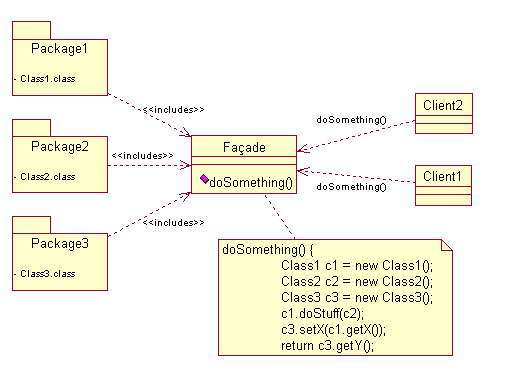
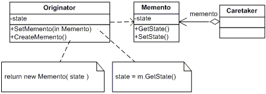

<link rel="stylesheet" href="http://yandex.st/highlightjs/6.1/styles/default.min.css">
<script src="http://yandex.st/highlightjs/6.1/highlight.min.js"></script>
<script>
hljs.tabReplace = '    ';
hljs.initHighlightingOnLoad();
</script>

# Introduction to Software Engineering
# Design Pattern Tutorial

Rami Sayar [@ramisayar](http://twitter/ramisayar)

[GitHub Talks](github.com/sayar/talks) If you find a mistake, don't hesitate to fork the repository, clone it to your local machine, edit the mistake, git commit -a -m and then press the pull request button to notify me.

## Why Design Patterns?

Design patterns are solutions widely accepted to solve certain classes of engineering problems. Almost all of these patterns were taken from best practices in industry. We will try not to have too much overlap with design patterns studied in the lecture. All the code samples in these notes follow the Bixi Case Study.

## Structural Design Patterns

Structural design patterns help the engineer address issues with the high-level class structure of complex software applications.

* Adapter
* **Bridge**
* **Composite**
* **Decorator**
* **Facade**
* Flyweight
* Proxy
* Retrofit Interface

### Bridge Pattern

The Bridge pattern allow you to decouple an abstraction from its implementation so that the two can vary. [Wikipedia Reference](http://en.wikipedia.org/wiki/Bridge_pattern)


```
public interface PaymentAccount {
    public void getBalance(); public void credit(int amount);
}

public class PrepaidCard implements PaymentAccount {
    private int balance;
    public PrepaidCard(int balance){this.balance = balance;}
    public void getBalance(){return this.balance;}
    public void credit(int amount){this.balance -= amount;}
}

public class CreditCard implements PaymentAccount {
    public void getBalance(){// Contact CC Processor}
    public void credit(int amount){// Contact CC Processor}
}

public class Account extends Saveable {
    private CreditCard cc;
    public Account(CreditCard cc){this.cc = cc;}
}

public class RenewableAccount extends Account {
    public renew(){//do something special}
}

public class PaymentStation {
    public void createAccount(){
        // Get CC credentials
        Account newAccount = new Account(this.getCCInput());
        newAccount.save();
    }
}
```

### Composite Pattern

The Composite pattern allows you to compose a collection of objects and treat them as a single object allowing you to have a single interface. It is mostly used to represent tree-based hierarchies or part-whole hierarchies as a composition into a single object. [Wikipedia Reference](http://en.wikipedia.org/wiki/Composite_pattern)


```
public class Location { int latitude; int longitude; }

public interface Place { public List‹Location› getLocations(); }

public class Region implements Place {
    public List‹Region› subRegions;
    public List‹Stations› localStations;

    public List‹Location› getLocations(){
        List‹Location› locs = new ArrayList‹Location›();
        for(Station s: this.localStations) {
            locs.addAll(s.getLocations());
        }
        for(Region r: this.subRegions) {
            locs.addAll(r.getLocations());
        }
        return stations;
    }
}

public class Station implements Place {
    public Location location;
    public List‹Location› getLocations(){
        // Return empty array.
        List‹Locations› locs= new ArrayList‹Locations›();
        locs.add(this.location);
        return locs;
    }
}

public class Map {
    public Place constructMontreal(){
        Region montreal = new Region();
        Region downtown = new Region();
        Region suburb = new Region();

        downtown.add(new Station());
        downtown.add(new Station());

        montreal.subRegions.add(downtown);
        montreal.subRegions.add(suburb);
        montreal.localStations.add(new Station());

        // Print Result
        montreal.getLocations();

        return montreal;
    }
}
```

### Decorator Pattern

From Wikipedia, "the Decorator pattern allows behaviour to be added to an individual, either statically or dynamically, without affecting the behaviour of other objects from the same class." [Wikipedia Reference](http://en.wikipedia.org/wiki/Decorator_pattern)

The decorator pattern can be considered an alternative subclassing. Also, the decorator can be used to add new behaviour at runtime. 


```
public class Bike {
    public int getComfortRating() {return 10;}
}

public class WideSeatBike {
    Bike decorated;
    public WideSeatBike(Bike decorated) {this.decorated = decorated;}
    public int getComfortRating(return this.decorated.getComfortRating()+10);
}

public class SuperFastBike {
    Bike decorated;
    public SuperFastBike(Bike decorated) {this.decorated = decorated;}
    public int getComfortRating(return this.decorated.getComfortRating()-5);
}

public class BikeFactory{
    public void createBestBike(){
        Bike BEST_BIKE_EVER = new SuperFastBike(new WideSeatBike(new Bike()));
        BEST_BIKE_EVER.getComfortRating(); //15

        Bike MOST_COMFY_BIKE_EVER = (new WideSeatBike(new Bike()));
        MOST_COMFY_BIKE_EVER.getComfortRating(); //20
    }
}
```

### Facade Pattern

The Facade pattern is essentially a means to provide a simple interface to a complex library of classes. It is also commonly called the application programming interface.



```
public class Bike {}
public class Accounts {}
public class Station {}

public class RESTAPI{
    public int getNumFreeBikes(){
        int num = 0;
        for(Station station: Map.constructMontreal().getStations()){
            num += station.getFreeBikes();
        }
        return num;
    }
}
```

## Behavioural Design Patterns

Behavioural design patterns change the behaviour or interaction of a set of objects.

* Binding Properties
* **Chain Of Responsibility**
* Command
* Interpreter
* Iterator
* **Mediator**
* **Memento**
* Observer
* State
* Strategy
* Template Method
* Visitor

### Chain of Responsibility

The Chain of Responsibility pattern allows you to chain the handling of an action through several objects, for example, sending a log message through several preprocessors before reaching its final destination. Thus, you can avoid tight coupling of the sender to the destination.


```
abstract class Supervisor {
    protected Supervisor next;
    public void setNext(Supervisor next) {
        this.next = next;
    }
    public void inform(String msg) {        
        if (next != null) {
            next.inform(msg);
        }
    }
}
 
class Manager extends Supervisor {
    public void inform(String msg) {
        // Do something!
        super.inform(msg)
    }
}
 
class Executive extends Supervisor {
    public void inform(String msg) {
        // Do something!
        super.inform(msg)
    }
}

class Mayor extends Supervisor {
    public void inform(String msg) {
        // Do something!
        super.inform(msg)
    }
}
// Creating a Chain
Manager manager = new Manager();
Executive exec = new Executive();
Mayor mayor = new Mayor();
manager.setNext(exec);
exec.setNext(mayor);
```

### Mediator

The Mediator pattern allows you to define how two objects interact and gives you the ability to change the nature of that interaction dynamically.


```
interface Resource {}
class Bike implements Resource {}
class TransportTruck implements Resource {}

interface Controller {
    public void coordinate();
}
class CheckInStation implements Controller {
    public void coordinate() {
        // Need more bikes/less bikes
    }
}
class HQ implements Controller {
    public void coordinate() {
        // Need to know status of resources for tracking
    }
}
```

### Memento

The Memento patterns allows you to break encapsulation and save the internal state of an object, which can allow you to restore an object or undo changes.



```
class Account {
    private CreditCard cc;
    public Account(CreditCard cc);
    
    public bool changeCreditCard(CreditCard cc);
    public AccountMemento createMemento();
    public void setMemento();
}

class AccountMemento {
    public CreditCard CC;
    // other stuff...
}

class CheckInStation {
    public class changeCC(Account account){
        AccountMemento original = account.createMemento();
        // Get User Credit Card
        account.changeCreditCard(this.getCCInput());
        // Confirm with User
        if (cancel){
            account.setMemento(original);
        }
        // Double check if funds are available.
        //...
    }
}
```

## Creational Design Patterns

Creational design patterns deal with the creation of objects.

* **Abstract Factory**
* **Builder**
* Factory Method
* Monostate
* Prototype
* **Singleton**

### Abstract Factory

"The abstract factory pattern is a software creational design pattern that provides a way to encapsulate a group of individual factories that have a common theme without specifying their concrete classes." [Wikipedia Reference](http://en.wikipedia.org/wiki/Abstract_factory_pattern)


```
abstract class Bike {}
class MountainBike extends Bike {}
class HighSpeedBike extends Bike {}

abstract class BikeProducer {
    public Bike createBike();
}
class MontrealCompany extends BikeProducer {
    public Bike createBike() { return new MountainBike(); }
}
class QuebecCompany extends BikeProducer {
    public Bike createBike() { return new HighSpeedBike(); }
}

// Class client can select a BikeProducer and pass it around to anybody
// who needs a bike.
```

### Builder

The Builder pattern allows you to abstract the different steps of an object's construction.


```
class MontrealCompany : extends BikeProducer
{
    BikeBuilder builder = new MountainBikeBuilder();
    // Builder uses a complex series of steps
    public Bike createBike()
    {
        builder.BuildFrame();
        builder.BuildWheels();
        return builder.bike();
    }
}
abstract class BikeBuilder
{
    protected Bike bike;
    public Bike getBike() { return this.bike; }
    public abstract void BuildFrame();
    public abstract void BuildWheels();
}
class MountainBikeBuilder extends BikeBuilder
{
    public MountainBikeBuilder() { this.bike = new MountainBike(); }
    public void BuildFrame() { // Set up mountain bike frame }
    public void BuildWheels() { // Set up wheels }
}
```

### Singleton

The Singleton pattern restricts the instantiation of a class to one object over a period of time and allows universal access to this object. [Wikipedia Reference](http://en.wikipedia.org/wiki/Singleton_pattern)

#### Bill Pugh Solution

```
public class Singleton {
        // Private constructor prevents instantiation from other classes
        private Singleton() { }
 
        /**
        * SingletonHolder is loaded on the first execution of Singleton.getInstance() 
        * or the first access to SingletonHolder.INSTANCE, not before.
        */
        private static class SingletonHolder { 
                public static final Singleton INSTANCE = new Singleton();
        }
 
        public static Singleton getInstance() {
                return SingletonHolder.INSTANCE;
        }
}
```

#### Joshua Bloch Solution

```
public enum Singleton {
    INSTANCE;
    public void execute (String arg) {
        //... perform operation here ...
    }
}
```
